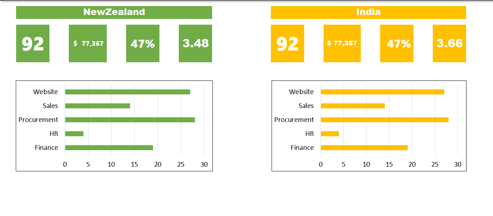
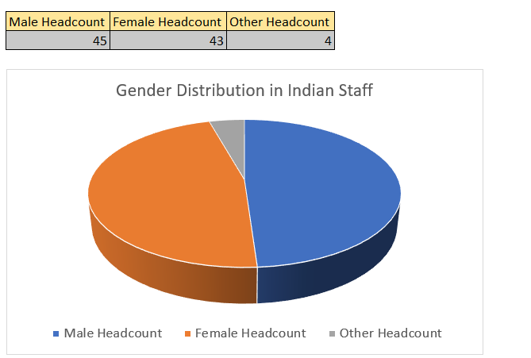

# Awesome-Chocolates-Data-analysis
📊 HR Analytics Excel Dashboard
📌 Project Overview

This project is an Awesome Chocolates HR Dashboard built in Excel that helps visualize and analyze workforce data. The goal was to transform raw employee data into meaningful insights using Excel formulas, pivot tables, slicers, and interactive charts.

The dashboard provides a single-page view of KPIs and workforce trends, enabling HR managers to make data-driven decisions.

⚙️ Features

✅ Raw → Clean → Analysis → Dashboard workflow
✅ Interactive slicers (Gender, Country) for dynamic filtering
✅ Automated lookups using XLOOKUP + TRANSPOSE
✅ Conditional formatting for salary distribution (red → green gradient)
✅ Key HR metrics: Total Employees, Avg Salary, Avg Age, Female Ratio %, Avg Tenure
✅ Interactive charts for workforce insights

🗂️ Project Structure

Data Tab → Raw dataset (with duplicates & blanks preserved)

IND Staff Tab → Clean dataset for Indian employees

NZ Staff Tab → Clean dataset for New Zealand employees, with tenure calculations & XLOOKUP data finder

Advance Tools Tab → Pivot summaries with slicers (Country, Gender)

Salary Spread Tab → Salary bands + performance ratings with conditional formatting

Employee Trend Tab → Hiring/attrition trends over time

Dashboard Tab → Central HR dashboard with KPIs & visuals

📊 Dashboard Visuals
🔹 KPI Cards

Total Employees

Avg Salary

Avg Age

Female Ratio %

Avg Tenure

🔹 Employee Trend (Line Chart)

Headcount growth/attrition trend over time.

🔹 Gender Ratio (Donut Chart)

Distribution of Male vs Female employees (filterable by slicer).

🔹 Performance Ratings (Column Chart)

Employee distribution across ratings (Exceptional, Above Avg, Avg).

🔹 Salary Distribution (Histogram)

Visual spread of employee salaries across bands.

🚀 Skills Demonstrated

Excel Formulas: XLOOKUP, TRANSPOSE, AVERAGEIFS, COUNTIF

Data Cleaning & Analysis in Excel

Pivot Tables & Slicers for interactivity

Data Visualization (Line, Bar, Donut, Column, Histogram)

Dashboard Design for storytelling with data

📌 How to Use

Download the Excel file from this repository.

Open the workbook in Excel.

Navigate to the Dashboard tab.

Use slicers to filter by Country/Gender and explore insights.

🔮 Future Improvements

Integrate with Power BI for more advanced visuals & auto-refresh.

Connect directly to a live database (MySQL/SQL Server).

Add predictive analytics (attrition prediction, salary forecasting).